# Noções preliminares

> Anotações a partir de Topoi (R. Goldblatt) e "Mini-curso de Introdução à Teoria de Categorias com aplicações à Lógica" (M. Coniglio).

## Categorias

Uma categoria $C$ consiste de:

1. Uma coleção $O$ de objetos;
2. Para cada par $\langle A, B \rangle$ de objetos, uma coleção de morfismos (em $C$) de $A$ em $B$. Essa coleção denota-se $Hom_C(A,B)$;
3. Uma operação parcial $\circ$ de composição entre morfismos;
4. Para cada objeto $A$, um morfismo $id_A$ tal que (1) $f \circ id_A = f$; e (2) $id_A \circ g = g$.


Na categoria **Type**, objetos são tipos *nat, list, bool,* etc, morfismos são funções

```coq
f : A -> B
```

onde $A, B$ são tipos. A função identidade é definida da seguinte maneira

```coq
Definition id {X : Type} a : X := a.
```

e a composição da seguinte maneira

```coq
Definition comp 
{X Y Z: Type} 
(f : X -> Y) (g: Y -> Z) := 
fun a => g (f a).
```

Nesta definição, $f$ vive em $Hom_{Type}(X,Y)$ e $g$ vive em $Hom_{Type}(Y, Z)$.

### Monomorfismos

> Generaliza a noção de função injetiva.

Uma flecha $h : A \rightarrow B$ é um monomorfismo se e somente se $h \circ g = h \circ f$ implica que $g = f$ para todo $g, f : C \rightarrow A$.

Ou seja, se o seguinte diagrama comuta

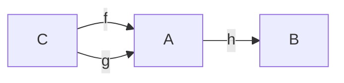

então $f = g$.

> Um monomorfismo é uma flecha que pode ser cancelada a esquerda da composição.

### Epimorfismos

> Generaliza a noção de função sobrejetiva.

> Intuição de imagem "suficientemente grande".

Uma flecha $h : A \rightarrow B$ é um epimorfismo se e somente se $g \circ h = f \circ h$ implica que $g = f$ para todo $g, f : B \rightarrow C$.

Ou seja, se o seguinte diagrama comuta

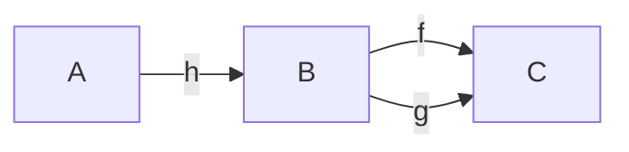

então $f = g$.

> Um epimorfismo é uma flecha que pode ser cancelada a direita da composição.

### Isomorfismos

> Um isomorfismo é uma flecha que possui inversa.

> Quais são os critérios suficientes e necessários para existir a inversa de uma função $f : A \rightarrow B$? Se $f$ é injetiva mas não é sobrejetiva, então $f^{-1} : B \rightarrow A$ não é uma função porque existiriam elementos do domínio $B$ sem imagem em $A$; por outro lado, se $f$ é sobrejetiva mas não é injetiva, então existiriam elementos do domínio com mais de uma imagem. Então é necessário que $f$ seja tanto injetiva quanto sobrejetiva para possuir inversa. Será suficiente? No caso das funções na categoria **Set**, sim. No caso mais geral de morfismos em quaisquer categorias, não: em certas categorias, existem flechas que são mono e epi mas não são iso.


Uma flecha $h : A \rightarrow B$ é um isomorfismo se e somente se existe uma flecha $g : B \rightarrow A$ tal que 

1. $h \circ g = id_A$; e
2. $g \circ h = id_B$.

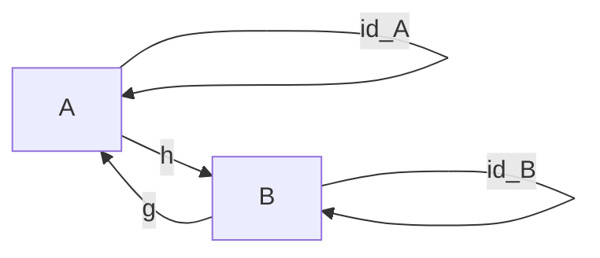

De modo geral, $g$ é a inversa de $h$, representada por $h^{-1}$.


### Objeto inicial

Um objeto $x$ de uma categoria $C$ é inicial se e somente se, para cada objeto $y$ em $C$, existe uma única flecha $! : x \rightarrow y$.

> Usualmente, denota-se o objeto inicial como $0$.
> > Exemplo: o conjunto vazio $\emptyset$ é o único objeto inicial da categoria **Set**.

### Objeto terminal

Um objeto $x$ de uma categoria $C$ é terminal se e somente se, para cada objeto $y$ em $C$, existe uma única flecha $! : y \rightarrow x$.

> Usualmente, denota-se o objeto terminal como $1$.
> > Exemplo: na categoria **Set**, existem infinitos objetos terminais (isomorfos): os conjuntos unitários.

### Equalizador

> O **maior lugar** em que dois morfismos coincidem.

Sejam $f, g : A \rightarrow B$ duas flechas. O equalizador de $f$ e $g$ é um par $\langle E, i \rangle$ tal que 

1. A flecha $i : E \rightarrow A$ satisfaz $f \circ i  = g \circ i$;
2. Se $\langle C , h \rangle$ é tal que $h : C \rightarrow A$ satisfaz $f \circ h = g \circ h$ então existe uma única flecha $k : C \rightarrow E$ que comuta o diagrama.

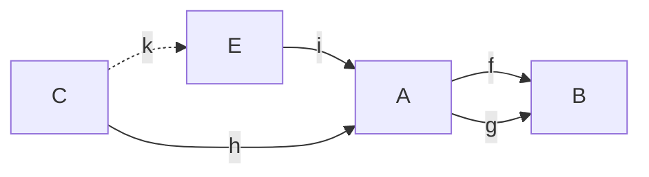

### Coequalizador

> O menor lugar em que dois morfismos coincidem.

Sejam $f,g : A \rightarrow B$ duas flechas. O coequalizador de $f$ e $g$ é um par $\langle E, q \rangle$  tal que

1. A flecha $q : B \rightarrow E$ satisfaz $q \circ f = q \circ g$;
2. Se $\langle C, h \rangle$ é tal que $h : B \rightarrow C$ satisfaz $h \circ f = h \circ g$ então existe uma única flecha $k : E \rightarrow C$ que comuta o diagrama.

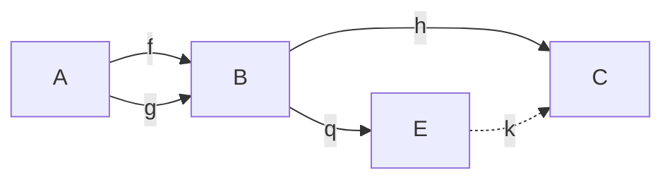

> Equalizador e coequalizador são conceitos duais.
 
### Pullback

> Produto fibrado.

Dado um par de flechas $f : A \rightarrow C$ e $g : B \rightarrow C$, o seu **pullback** é um par $\langle D, \{p_1, p_2\}\rangle$ sendo $p_1 : D \rightarrow A$ e $p_2 : D \rightarrow B$ e tal que o diagrama abaixo comuta.

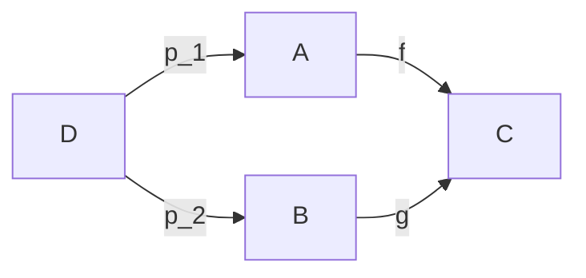

#### Propriedade universal do pullback

> Único a menos de isomorfismo.

Seja $\langle E, \{q_1, q_2\}\rangle$ um par tal que $q_1 : E \rightarrow A$ e $q_2 : E \rightarrow B$ são morfismos que comutam o diagrama abaixo

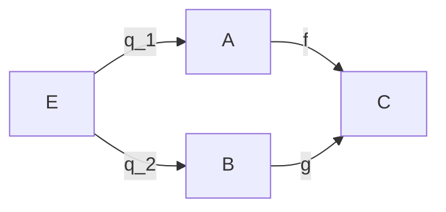

Então existe uma única flecha $k : E \rightarrow D$ que comuta o seguinte diagrama:

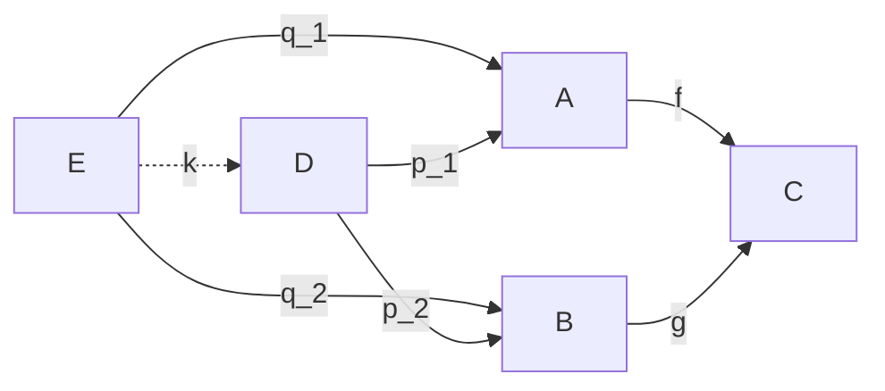

### Pushout

Dado um par de flechas $f : A \rightarrow B$ e $g : A \rightarrow C$, o pushout desse par é um par $\langle D, \{ p_1, p_2 \} \rangle$ onde $p_1 : B \rightarrow D$ e $p_2 : C \rightarrow D$ são flechas que comutam o seguinte diagrama:

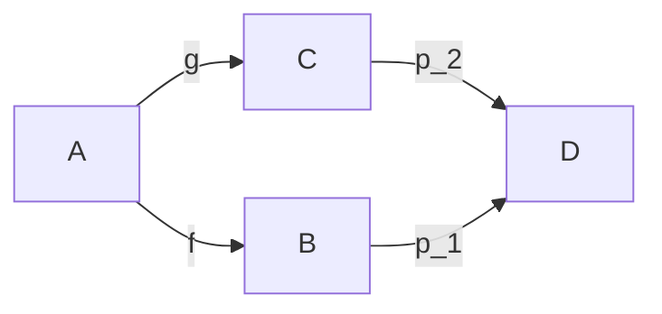

#### Propriedade universal do pushout

> Único a menos de isomorfismo.

Seja $\langle E, \{q_1, q_2\}\rangle$ um par tal que $q_1 : B \rightarrow E$ e $q_2 : C \rightarrow E$ são morfismos que comutam o diagrama abaixo

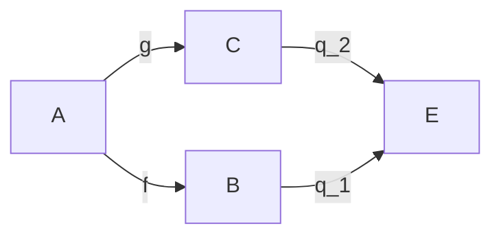

Então existe uma única flecha $k : D \rightarrow E$ que comuta o seguinte diagrama:

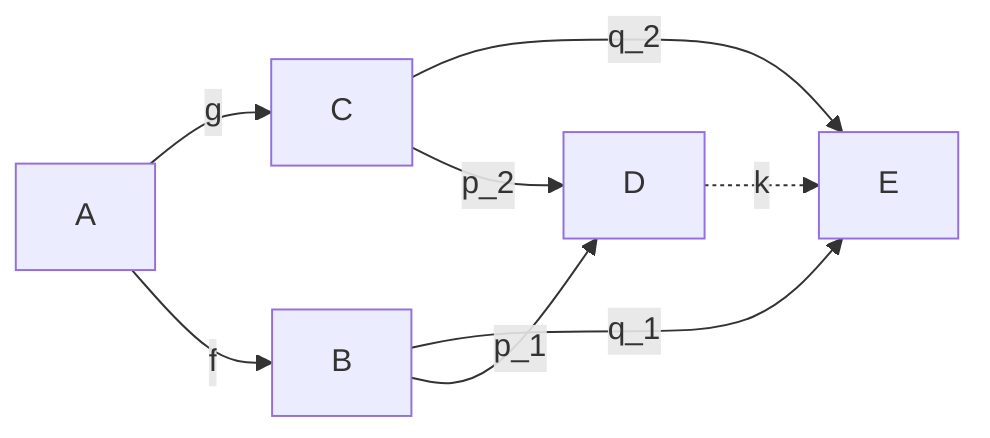

> Pullback e pushout são conceitos duais.

### Limite

> Um diagrama em uma categoria $C$ é um par $D = \langle O, M \rangle$ tal que $O = \{A_i\}_{i \in I}$ é uma família de objetos de $C$ e $M \subseteq \bigcup_{i,j \in I} Hom_C(A_i, A_j)$ é um conjunto de morfismos entre objetos de $O$. (p. 34, apostila)

Um cone para um diagrama $D = \langle O, M\rangle$ numa categoria $C$ é um objeto $N$ de $C$ junto com uma família $\{ f_i \}_{i \in I}$ tal que cada $f_i  : N \rightarrow A_i$ é um morfismo em $C$ que comuta para todo $f \in M$. 

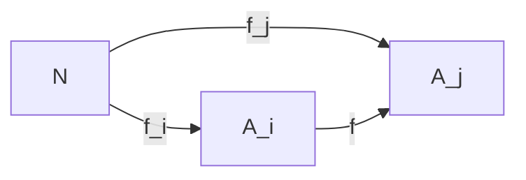

Um limite para um diagrama $D$ é um cone $\langle L, \{ F_i \}_{i \in  I} \rangle$ tal que, dado qualquer outro cone $\langle N, \{ f_i \}_{i \in  I} \rangle$ para o diagrama $D$, existe uma única flecha $k : N \rightarrow L$ tal que $F_i \circ k = f_i$ para todo $i \in I$.

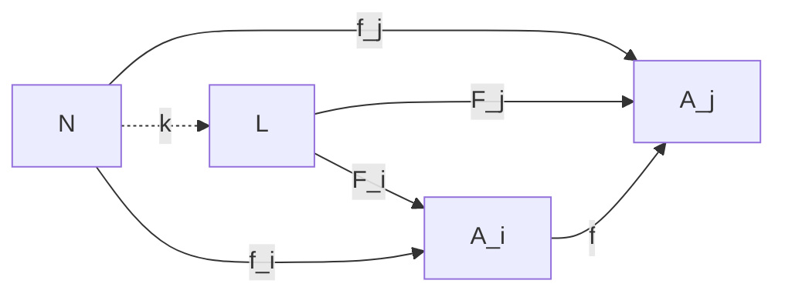

### Colimite

Primeiro, definimos o dual do cone. Um *cocone* de um diagrama $D$ é um par $\langle N, \{ f_i \}_{i \in I} \rangle$ tal que $f_i : A_i \rightarrow C$ é um morfismo em $C$ que comuta o seguinte diagrama:

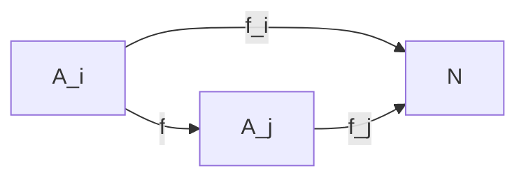

Um colimite de $D$ é um cocone $\langle L, \{ F_i \}_{i\in I} \rangle$ tal que, dado qualquer outro cocone $\langle N, \{ f_i \}_{i \in I} \rangle$, existe uma única flecha $k : L \rightarrow N$ tal que $k \circ F_i = f_i$ para todo $i \in I$.

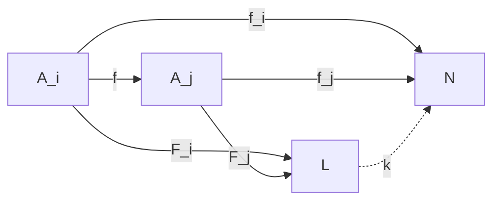

> Uma categoria $C$ é completa se todo diagrama possui um limite. $C$ é cocompleta se todo diagrama possui um colimite.

### Produtos

### Coprodutos

### Exponenciação

> Generaliza a noção de "espaço de funções de $A$ em $B$".

Seja $C$ uma categoria com produtos binários. O exponencial de dois objetos $A$ e $B$ é um par $\langle B^A , ev_{BA} \rangle$, onde $ev_{BA} : B^A \times A \rightarrow B$ é tal que, para todo objeto $C$ e flecha $f : C \times A \rightarrow B$, existe uma única flecha $\bar{f} : C \rightarrow B^A$ tal que $ev_{BA} \circ (\bar{f} \times id_A) = f$. Ou seja, o seguinte diagrama comuta. 

Chamaremos o conjunto $B^A \times A$ de $X$, $C \times A$ de $Y$ e o morfismo $\bar{f} \times id_A$ de $g$.

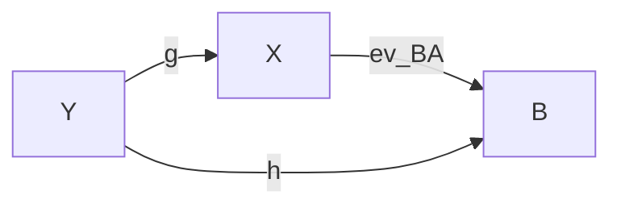

> Em uma categoria localmente pequena como **Set**, $B^A$ corresponde ao conjunto de todos os morfismos dessa categoria. Isto é, ao conjunto $Hom_C(A, B)$.

> Em **Set**, portanto, $B^A$ é o conjunto de todas as funções $f : A \rightarrow B$. Para provar isso, precisamos mostrar que existe uma bijeção entre $Hom(C, Hom(A, B))$ e $Hom(C \times A, B)$. 

> Uma categoria com exponenciais é uma *categoria cartesiana fechada*.


### Funtores

Um funtor $F$ é um morfismo que leva de uma categoria $X$ para outra categoria $Y$ preservando a estrutura original, isto é,

1. Para cada objeto $a$ de $X$, existe um objeto $F(a)$ correspondente em $Y$;
2. Para cada morfismo $f : a \rightarrow b$, um morfismo $F(f) : F(a) \rightarrow F(b)$, tal que: 
   1. $F(id_a) = id_{F(a)}$;
   2. $F(g  \circ f) = F(g) \circ F(f)$, sempre que a composição existe.


 Quando $X = Y$, $F$ é um **endofuntor**. 

> **id** é um exemplo de endofuntor.


Para ilustrar, considere o tipo parametrizado *Maybe* definido abaixo.

```coq
Inductive Maybe (X : Type) :=
| Some (a : X)
| None.

Check Some nat 2.
: Maybe nat
```

Observe que *Maybe* não é um tipo, mas um construtor de tipos. 

```coq
Check Maybe.
: Type -> Type
```

Para um morfismo $F$ ser um funtor, além de $F$ mapear objetos (no caso, tipos) de um tipo a outro, $F$ deve mapear todos os morfismos entre os objetos daquele tipo. Por exemplo, seja $f$ um morfismo 

```
f : nat -> bool
```

Para isso, definimos a função de ordem superior **fmap** abaixo

```coq
Definition fmap 
{X Y : Type}
(f : X -> Y)
: Maybe X -> Maybe Y :=
fun (a : Maybe X) =>
match a with
| Some _ b => Some Y (f b)
| None _ => None _
end.
```

De modo mais geral, podemos definir a classe dos endofuntores na categoria *Type* da seguinte maneira

```coq
Class Functor
(X Y : Type)
(f : Type -> Type) :=
{
  fmap2 : (X -> Y) -> f X -> f Y
}.
```

Sendo o funtor Maybe um caso particular (instância)

```coq
Instance MaybeMap {X Y : Type} : 
Functor X Y Maybe :=
{
  fmap2 f a := 
    match a with
    | Some _ b => Some _ (f b)
    | None _ => None _
    end
}.
```

## Subobjeto

> Generaliza a noção de subconjunto

Seja $C$ uma categoria e $B$ um objeto de $C$. Um subobjeto de $B$ é um monomorfismo $m : A \hookrightarrow B$ com codomínio $B$. 

> Fixe um objeto $A$ de uma categoria pequena $C$. Definimos a seguinte relação no conjunto de monomorfismos com co-domínio $A$ : $m \sim n$ sse existe um isomorfismo $f : Dom(m) \rightarrow Dom(n)$ tal que $m = n \circ f$. (p. 43, apostila)

O seguinte diagrama comuta

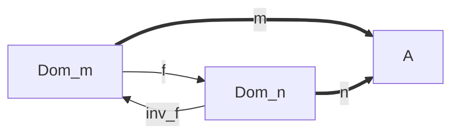

A relação $\sim$ é uma relação de equivalência.

> Uma relação de equivalência $\equiv$ possui as seguintes propriedades:
> 1. $a \equiv a$ (reflexividade);
> 2. $a \equiv b \Rightarrow b \equiv a$ (simetria);
> 3. $a \equiv b$ e $b \equiv c$ então $a \equiv c$ (transitividade).
> > Para todo morfismo $m$, $m \sim m$ ($\sim$ é reflexivo). Sabemos que $m \sim m$ se e somente se existe um isomorfismo $f : Dom(m) \rightarrow Dom (m)$. Tome $f = id_{Dom(m)}$. Sabemos que $id_A^{-1} = id_A$, para todo $A$. Portanto, $id_{Dom(m)}$ é um isomorfismo. Além disso, $m = m \circ id_{Dom(m)} \Rightarrow m = m$.
>
> > Para todo $m , n$, se $m \sim n$ então $n \sim m$. Assuma que $m \sim n$. Então existe um isomorfismo $f : Dom(m) \rightarrow Dom(n)$ tal que (A) $m = n \circ f$. Precisamos mostrar que existe um isomorfismo de $Dom(n)$ a $Dom(m)$. Tome $f^{-1}$ (cuja inversa é $f$). Precisamos mostrar que (B) $n = m \circ f^{-1}$. Substituindo A em B, temos que $n = (n \circ f) \circ f^{-1} \Rightarrow n = n \circ (f \circ f^{-1}) \Rightarrow n = n$.
> 
> > Transitividade. Sejam $m, n, p$ três morfismos. Queremos mostrar que, se $m \sim n$ e $n \sim p$ então $m \sim p$. Isso é equivalente a mostrar que existe um isomorfismo $h: Dom(m) \rightarrow Dom(p)$ que comuta o diagrama abaixo.

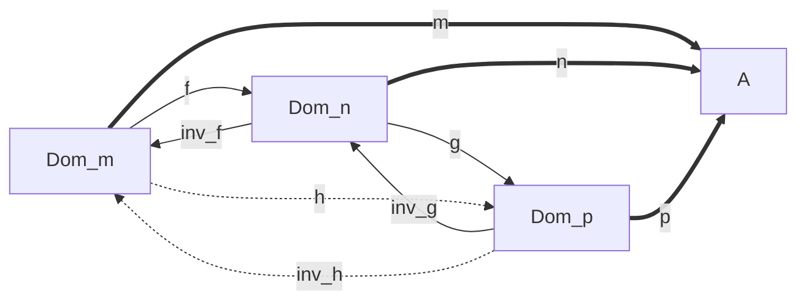

> > Tome $h = g \circ f$. Claramente, $h^{-1} = f^{-1} \circ g^{-1}$, portanto, $h$ é isomorfismo. Resta mostrar que $m = p \circ h$. Sabemos que $m = n \circ f$ e $n = p \circ g$. Fazendo as substituições, obtemos $(p \circ g) \circ f = p \circ h \Rightarrow p \circ (g \circ f) = p \circ h$. Por hipótese, $h = g \circ f$, portanto, $p \circ h = p \circ h$.

Chamaremos de $Sub(A)$ ao conjunto de classes de equivalência $[m]$ de monomorfismos $m : Dom(m) \hookrightarrow A$.

> Seja $[m_i] \in Sub(A)$. Para $i = (1,2)$, dizemos que $[m_1] \leq [m_2]$ sse existe um morfismo $f : Dom(m_1) \rightarrow Dom(m_2)$ tal que $m_1 = m_2 \circ f$. Observe que cada $m_i$ é um monomorfismo que sai de $Dom(m_i)$ e vai para $A$. A flecha $f$ não precisa ser monomorfismo.

Ou seja, o seguinte diagrama comuta.

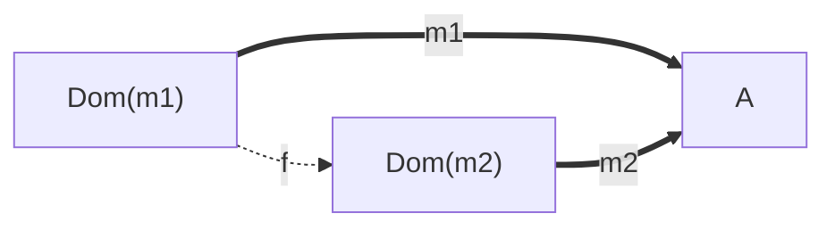

> Em particular, temos que $[m_n] \leq [m_n]$, para todo $n \in I$ (tome $f = id_{Dom(m_n)}$, indução em $n$).

 > $\langle Sub(A), \leq \rangle$ é uma ordem parcial. Ou seja: reflexiva, anti-simétrica e transitiva. Anti-simetria: se $[m_1] \leq [m_2]$ e $[m_2] \leq [m_1]$, então $[m_1] = [m_2]$.
 
> $\langle  Sub(A), \leq \rangle$ é uma álgebra de Heyting.

#### Imagem inversa

 Um subobjeto pode ter imagem inversa. Seja $f : A \rightarrow B$ um morfismo e $i : C \hookrightarrow B$ um subobjeto de $B$, a *imagem inversa de i por f* é o monomorfismo $f^{-1}(i) : f^{-1}(C) \hookrightarrow A$ dado pelo seguinte pullback:

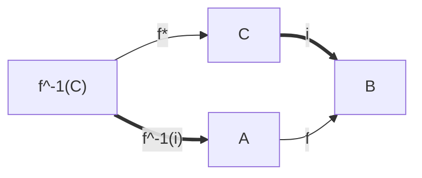

> Mostrar que é pullback.

### Classificador de subobjetos

A função característica de um conjunto $S \subseteq A$ é uma função $\chi_S : A \rightarrow 2$ tal que 

$$
  \chi_S(x) =
  \begin{cases}
    1 & \text{se $x \in S$} \\
    0 & \text{caso contrário}
  \end{cases}
$$

> Existe uma bijeção entre os subconjuntos $S$ de $A$ [ou seja, $P(A)$] e as suas funções características. (p. 45, apostila)
>
> > Por essa razão, o conjunto das partes é por vezes denotado por $2^A$. Lembrando que $2^A$ corresponde ao conjunto de todas as funções $f : A \rightarrow 2$ na categoria **Set**.

Ainda dentro da categoria **Set**, considere $g : A \rightarrow 2$ e defina $B_g = \{ x \in A : g(x) = 1 \}$, isto é, o conjunto de todos os elementos em $A$ tais que $g(x) = 1$. Nesse caso, a função característica de $B_g$ é a própria $g$, já que

$$
  \chi_{B_g}(x) =
  \begin{cases}
    1 & \text{se $x \in B_g$} \\
    0 & \text{caso contrário}
  \end{cases}
$$

ou seja: mesmos outputs para os mesmos inputs. 

> Para todo $x \in A$, $\chi_{B_g}(x) = 1$ se e somente se $g(x) = 1$. 
> > Por definição, se $g(x) = 1$, então $x \in B_g$. Mas, se $x \in B_g$, então $\chi_{B_g}(x) = 1$. Similarmente para a ida.

Observe que $g^{-1} : 2 \rightarrow A$ é uma função que, dado um elemento de $2 = \{0,1\}$, manda para o elemento de $A$ correspondente de tal modo que $g^{-1} \circ g = id_A$ e $g \circ g^{-1} = id_2$. Dado que $\chi_{B_g} = g$, temos que $B_g = g^{-1}(\{1\})$ [a imagem da inversa da função característica de $B_g$ restrita a $\{ 1 \}$]. Ou seja, o diagrama abaixo é um pullback.

```mermaid
graph LR;
    Bg==>A;
    1["{1}"]==>2;
    Bg--!-->1["{1}"];
    A--g-->2;
```

Generalizando para qualquer categoria, obtemos a noção de *classificador de subobjeto*. Seja $C$ uma categoria com objeto terminal **1**. Um classificador de subobjetos para $C$ é um par $\langle \Omega, true \rangle$ tal que $\Omega$ é um objeto de $C$ e $true : 1 \rightarrow \Omega$ é um morfismo de $C$ que satisfaz a seguinte propriedade: 

> Para cada monomorfismo $f : B \hookrightarrow A$, existe um único morfismo $\chi_f : A \rightarrow \Omega$ tal que o diagrama abaixo é um pullback. (p. 46, apostila)

```mermaid
graph LR;
    A--Xf-->Omega;
    1==true==>Omega;
    B==f==>A;
    B--!-->1;
```

No livro Topoi, essa propriedade é chamada de *Axioma* $\Omega$ (p. 81). A flecha $\chi_f$ é chamada de flecha característica do monomorfismo $f$.

## Topos

> pp. 49-50, apostila.

Um **topos** é uma categoria $C$ que satistaz as seguintes condições:

> 1. $C$ é finitamente completa.
> 2. $C$ é finitamente cocompleta.
> 3. $C$ tem classificador de subobjetos.
> 4. $C$ tem exponenciação.

ou

> 1. $C$ tem objeto terminal.
> 2. $C$ tem pullback
> 3. $C$ tem classificador de subobjetos.
> 4. $C$ tem exponenciação.
 
Além disso,

> Uma categoria $C$ é um topos se e somente se $C$ é cartesiana fechada e tem classificador de subobjetos.

> **Teorema fundamental dos topos**. Se $C$ é um topos e $A \in |C|$, então $C \downarrow A$ é um topos. 

## Reticulado

Um reticulado é um conjunto $R$ equipado com duas operações binárias, **meet** $(a \sqcap b)$ e **join** $(a \sqcup b)$, com relação as quais valem as seguintes identidades para todos elementos $a,b,c \in R$:

### Comutatividade
1. $a \sqcap b = b \sqcap a$;
2. $a \sqcup b = b \sqcup a$;
   
### Associatividade
3. $a \sqcap (b \sqcap c) = (a \sqcap b) \sqcap c$;
4. $a \sqcup (b \sqcup c) = (a \sqcup b) \sqcup c$;

### Absorção
5. $a \sqcup (a \sqcap b) = a$;
6. $a \sqcap (a \sqcup b) = a$;

### Idempotência
7. $a \sqcup a = a$;
8. $a \sqcap a = a$.

### Ordem

Uma ordem em um reticulado $R$ é uma relação entre elementos $a, b$ de $R$, denotada por $a \sqsubseteq b$ (a é menor ou igual a b). Essa relação respeita os seguintes axiomas.

1. $\forall a : a \sqsubseteq a$ [Reflexividade] 
2. $\forall a, b : a \sqsubseteq b \land b \sqsubseteq a \rightarrow a = b$ [Anti-simetria]
3. $\forall a, b, c : a \sqsubseteq b \land b \sqsubseteq c \rightarrow a \sqsubseteq c$ [Transitividade]

## Álgebra de Heyting

> (cap. 8)

Proposta em $1930$ por Arend Heyting, trata-se de um sistema axiomático da lógica proposicional que gera como teoremas aquelas, e apenas aquelas, "sentenças que são válidas de acordo com a *concepção intuicionista da verdade*" (p. $177$). 

> (p.177-178, sec 8.2)
>> Of course the intuitionist only accepts formal systems as **imperfect tools** for description and communication. He leaves open the possibility that his intuitive deliberations will one day reveal as yet unheard of principles of reasoning. According to Heyting, 'in principle it is impossible to set up a formal system which would be equivalent to intuitionist mathematics ... it can never be proved with mathematical rigour that the system of axioms really embraces every valid method of proof.' 

## Limite superior e limite inferior

Primeiro, precisamos ampliar o sentido da relação $\sqsubseteq$, que foi definida anteriormente apenas para pares de elementos. Nesse contexto, $x \sqsubseteq y$ denota **y é maior que x** (ou **x é menor ou igual a x**). Na extensão que será feita nesta seção, permitiremos que os parâmetros sejam conjuntos. Queremos que $A \sqsubseteq x$ denote **x é limite superior do conjunto A** e $x \sqsubseteq A$ denote **x é limite inferior do conjunto A**. Para isso, quantificaremos sobre o conjunto de elementos.

Seja $A$ um sub-conjunto de um reticulado $R = (L, \sqsubseteq)$ e $x$ um elemento de $R$. Definimos:

1. **Limite superior** $(A \sqsubseteq x)$

$$
\forall y (y \in A \rightarrow y \sqsubseteq x)
$$

2. **Limite inferior** $(x \sqsubseteq A)$

$$
\forall y (y \in A \rightarrow x \sqsubseteq y)
$$

A partir dessa extensão, poderemos definir limite superior mínimo e limite inferior máximo.

> Seja $A$ um subconjunto de um reticulado $R = (L, \sqsubseteq)$, e $x \in L$. Dizemos que $x$ é um **limite superior** de $A$ ($A \sqsubseteq x$), se, para todo $y \in A$, $y \sqsubseteq x$.
>> Ou seja, $x$ é limite superior de $A$ se $x$ for limite superior de todos os elementos de $A$.

Se, além disso, $x \sqsubseteq z$ para todo $A \sqsubseteq z$ (ou seja, todo limite superior de $A$ é um limite superior de $x$), então $x$ é minimal, que chamaremos de **limite superior mínimo** (l.s.min).

> Diremos que $x$ é o **maior elemento** de $A$ se $x \in A$ e $x$ é l.s.min de $A$.

### Exercícios
#### Exercício 1
> *A possui no máximo um limite superior mínimo.* 
> >**Prova:** Supõe que $x$ é um limite superior mínimo de $A$. Então, além de $A \sqsubseteq x$, $x$ é minimal. Agora supõe que existe outro limite superior mínimo de $A \sqsubseteq x'$. Por definição, para todo $A \sqsubseteq z$, temos que $x' \sqsubseteq z$. Como $A \sqsubseteq x$, temos que $x' \sqsubseteq x$. De maneira análoga, como $x$ é minimal, temos que $x \sqsubseteq x'$. Logo, $x = x'$ (por anti-simetria).

#### Exercício 2

> Defina **limite inferior máximo**. 
> >Seja $A$ um sub-conjunto de um reticulado $R_L = (L, \sqsubseteq)$ e $x \in L$. Diremos que $x \sqsubseteq A$ ($x$ é um limite inferior de $A$) se, e somente se, $x \sqsubseteq y$ para todo $y \in A$. Se, além disso, $z \sqsubseteq x$ para todo $z \sqsubseteq A$, então $x$ é um limite inferior máximo.

#### Exercício 3

> *Um limite inferior máximo de A é o maior elemento do conjunto de limites inferiores de A.*
> > **Prova:** Seja $x$ um limite inferior máximo de $A$. Precisamos mostrar que (1) $x$ é um elemento do conjunto de limites inferiores de $A$ (chamaremos de $\Omega$); e (2) $x$ é l.s.min de $\Omega$. Como $x$ é l.i.max de $A$, em particular $x$ é um limite inferior de $A$ e, portanto, temos que $x \in \Omega$. Resta mostar que $x$ é l.s.min de $\Omega$, ou seja: (2.a) $\Omega \sqsubseteq x$;  e (2.b) $\forall z$, se $\Omega \sqsubseteq z$, então $x \sqsubseteq z$. Sabemos que $\Omega \sqsubseteq x$ sse $y \sqsubseteq x$ para todo $y \in \Omega$. Por definição, $x$ é o l.i.max de $A$; logo, para todo limite inferior de $A$ (chamemos de $z$), vale que $z \sqsubseteq x$. Ora, $\Omega$ é justamente o conjunto de limites inferiores de $A$, portanto, para todo $x' \in \Omega$, temos que $x' \sqsubseteq x$ (2.a).

#### Exercício 4

> Defina o **menor elemento** de $A$.
> > Diremos que $x$ é o **menor elemento** de $A$ se: 
> > 1. $x \in A$;
> > 2. $x$ é l.i.min de $A$. 


> Exemplo: considere o reticulado conjunto das partes de $X$ $(P(X), \subseteq)$. Nesse reticulado, o menor elemento é o conjunto vazio $(\emptyset)$; e o maior elemento é $X$. 

### Complemento

O **complemento** (ou **pseudo-complemento**, já que pode ser uma operação não-booleana [a depender do reticulado]) de um elemento $a$ de um reticulado $R = (L, \sqsubseteq)$, denotado por $\bar{a}$, é o maior elemento disjunto de $a$:

$$
\bar{a} = max (x \in L  \mid a \sqcap x = 0)
$$

> Isso implica que, no exemplo do reticulado do conjunto das partes, $A \cap \bar{A} = \emptyset$ [porque disjunto] e, sempre que $A \cap B = \emptyset$, então $B \subseteq \bar{A}$ [porque maximal].

Um reticulado $R$ tal que todo elemento de $R$ possui um pseudo-complemento é um **reticulado pseudo-complementado**.

#### Exercício 5

> $b$ é o maior disjunto de $a$ precisamente quando $b$ satisfaz a condição: 
> 
> >(C) $\forall x \in L$, $x \sqsubseteq b$ $\Leftrightarrow$ $a \sqcap x = 0$.
> 
> > Supõe que $b$ satisfaz a condição (C). Então temos que mostrar que $b$ é o maior disjunto de $a$. Considere o conjunto $\Omega$ de todos os $x \sqsubseteq b$, isto é, o conjunto dos limites inferiores de $b$. Por definição, $b$ é um limite superior de $\Omega$. Para obter minimalidade, observe que $\sqsubseteq$ é transitivo. Portanto, $b$ é l.s.min de $\Omega$. Como, além disso, $b \in \Omega$, temos que $b$ é o maior elemento de $\Omega$, por definição. Além disso, por hipótese $(\Leftarrow)$, todos os disjuntos de $a$ estão no conjunto $b$. Portanto, $b$ é o maior disjunto de $a$.

#### Exemplos

Dados $A, B \in D$, definimos

1. Complemento: $\bar{A} = \{x \mid x \in D$ e $x \not\in A\}$
2. Intersecção: $A \cap B = \{ x \mid x \in A$ e $x \in B \}$ 
3. União: $A \cup B = \{ x \mid x \in A$ ou $x \in B \}$

O conjunto das partes $P(D)$, junto com as operações $\cap, \cup, \bar{}$ , "exibem a estrutura daquilo que entendemos por ... Álgebra booleana" (cap. 6, pag. 125)

> These algebras, to be defined shortly, are intimately connected with the classical account of logical truth. (p. 125)

No reticulado do conjunto das partes  $R = (P(D), \subseteq)$, $\bar{A}$ é o pseudo-complemento de $A$. Para provar isso, temos que mostrar que, para todo elemento $x$ de $P(D)$, se $x$ está contido no complemento de $A$, então $x$ é disjunto de $A$. Além disso, se $x$ é disjunto de $A$, então $x$ está contido no complemento de $A$ ($\bar{A}$ é maximal). Ou seja:

$$
    \forall x \in P(D), x \subseteq \bar{A} \Leftrightarrow A \cap x = \emptyset
$$

> Assuma que $x \subseteq \bar{A}$. Nesse caso, todo elemento de $x$ está em $\bar{A}$. Pela definição de complemento, $\bar{A}$ não possui nenhum elemento de $A$. São, portanto, disjuntos. Por definição de sub-conjunto, não existe nenhum elemento em $x$ além daqueles que estão em $\bar{A}$; em particular, não existe nenhum elemento de $A$ em $x$, isto é, $x$ e $A$ também são disjuntos. Para a volta, assuma que $A \cap x = \emptyset$. Observe que o complemento contém todos os elementos que não estão em $A$, já que pega todos os elementos do universo $(D)$ que não pertencem a $A$. Portanto, se $A$ é disjunto de $x$, então $x$ deve estar contido em $\bar{A}$.

#### Sub(A)

> p. 180[197]

Em $Sub(A)$ de qualquer topos, o pseudo-complemento de um morfismo $f : A \rightarrow B$ é um morfismo $\bar{f} : \bar{A} \rightarrow B$. 

> Para provar isso, precisamos mostrar que $g \subseteq \bar{f}$ sse $f \cap g \simeq 0_B$

Supõe que $f \cap g \simeq 0_B$. Isso é o mesmo que dizer que o diagrama formado pelas flechas em negrito é um pullback.

```mermaid
graph LR;
    A==f==>B;
    A--->1;
    0===>A;
    0==0b==>C;
    C==g==>B;
    1--true-->Omega;
    B--Xf-->Omega;
```

### Definição de uma álgebra de Heyting


> Uma **álgebra de Heyting** (**HA**) é um reticulado $\Omega = (H, \sqsubseteq)$ relativamente pseudo-complementado que possui um zero (**0**).


Uma álgebra de Heyting é completa quando todo subconjunto de $\Omega$ possui l.s.max e l.i.min.

# Conjuntos Heyting-valorados

## Linguagem

### Alfabeto

1. Uma lista infinita $v_1,v_2, \cdots$ de variáveis individuais;
2. Conectivos proposicionais $\land, \lor, \sim, \supset$;
3. Símbolos de quantificação $\forall, \exists$;
4. Símbolo de identidade $\approx$;
5. Parênteses ), (.

> A partir desta linguagem, podemos descrever uma estrutura listando seus **símbolos de relação**, **letras de função** e **constantes individuais**.

Exemplo: 

$$
 \textbf{BA} = \{ 0,1,f,g,h \}
$$

onde $f(v)$ significa "o complemento de $v$", $g(v_1,v_2)$ significa "o meet de $v_1$ com $v_2$" e $h(v_1,v_2)$ significa "o join de $v_1$ com $v_2$".

> (cap. 11, sec. 9, pp. 274--..).

### (A) Tudo que é igual a algo que existe, existe

Seja $C$ um topos e $c \in |C|$ um objeto de $C$. Podemos compreender $c$ como um objeto "set-like"  **parcialmente existente** (*partially existent*) ou como **realmente existente** (*actually existent*). O fato de que o objeto $c$ é **realmente existente** é expresso por $\textbf{E(c)}$

1. $\textbf{E(c)} \equiv \exists v (v\approx \textbf{c})$

Ou seja, "tudo que é igual a algo que existe, existe".

> Observe que $\textbf{E}$ é um predicado e a variável ligada $v$ na expressão varia entre os elementos parcialmente existentes de um conjunto $\Omega$. Como veremos mais tarde, esse conjunto admite uma álgebra de Heyting.

O segundo princípio formalizado por Goldblatt é

### (B) Elementos só podem ser iguais se realmente existentes

Em outras palavras, "igualdade implica existência". Formalizando:

2. $v \approx w \supset E(v) \land E(w)$

Podemos derivar (A) a partir de (B). Tome $v = w$ em (2),

$$
\begin{align}
    v \approx v \supset E(v) \land E(v) \\
    v \approx v \supset E(v)
\end{align}
$$

Por essa razão, chamaremos $\approx$ de **equivalência forte** ou simplesmente **igualdade**.

## Dois sentidos para "sameness"


**Bicondicional** $\equiv$. Relação entre fórmulas.

$$
    A \equiv B  \Leftrightarrow (A \supset B) \land (B \supset A)
$$

Onde $A$ e $B$ são fórmulas válidas.

**Equivalência enfraquecida** $\approxeq$. Relação entre objetos. Dois elementos $v$ e $w$ são **fracamente equivalentes** quando: **(a)** nenhum deles existe; ou **(b)** quando ambos existem e são iguais.

1. $v \approxeq w \equiv (E(v) \lor E(w) \supset v \approx w)$

> Essa noção de equivalência enfraquecida "não diferencia os elementos com respeito a sua inexistência". Se dois elementos não existem eles são fracamente equivalentes.

Em suma, $\approx$ e $\approxeq$ são duas relações simétricas: é possível descrever a igualdade em termos da equivalência.

4. $v \approx w \equiv (v \approxeq w) \land (E(v) \land E(w))$

Ou seja, dois elementos $v$ e $w$ são idênticos se, e somente se, ambos existem e são fracamente equivalentes.

## Exemplo do Bundle

> Observe que $Bn(I) = Set \downarrow I$, onde $Set \downarrow I$ denota a categoria onde os objetos são os morfismos $m : A \rightarrow I$ da categoria **Set** (ou seja, os morfismos de **Set** com co-domínio $I$). Como **Set** é um topos, pelo teorema fundamental dos topos, $Bn(I)$ é um topos. Sendo assim, podemos considerá-lo como modelo.

Categoria dos bundles (fibrados). Objetos são funções $f : A \rightarrow I$. Um morfismo $\bar{k} : f \rightarrow g$ entre um objeto $f$ e outro objeto $g$ é uma flecha tal que o diagrama abaixo comuta:

```mermaid
graph LR;
    B["Dom(f)"]--k-->C["Dom(g)"];
    B["Dom(f)"]--f-->A;
    C["Dom(g)"]--g-->A;
```

> Objetos de $Bn(I)$ são famílias de conjuntos $\{ A_i \}_{i \in I}$ disjuntos dois a dois. (p. 51, Apostila)

Sejam $f$ e $g$ dois elementos parciais de um bundle $A \rightarrow I$ sobre um conjunto $I$. Definimos a medida de igualdade entre $f$ e $g$ como o conjunto

$$
[[ f \approx g ]] = \{ i \in I \mid f(i) = g(i) \}
$$ 


Em um extremo, os morfismos $f$ e $g$ são iguais na medida em que suas imagens coincidem. No outro extremo, $A_n \cap A_m = \emptyset$ e $[[ f \approx g ]] = 0$.

## Conjuntos $\Omega$-valorados

> p. 276-..

Nesse modelo, um **conjunto** é uma coleção de elementos parciais, com alguma medida alébrica Heyting-valorada de graus de igualdade (*equality*) entre eles.

Essa noção admite o seguinte "desenvolvimento axiomático abstrato":

> Uma álgebra de Heyting completa (**AHC**) é uma álgebra de Heyting na qual todo sub-conjunto $A \subseteq \Omega$ possui um "limite superior mínimo" (*least upper bound*), denotado por $\sqcup A$, e um "limite inferior máximo" (*greatest lower bound*), denotado por $\sqcap A$.

> Seja $(\Omega, \sqsubseteq)$ uma **AHC**. Um conjunto $\Omega$-valorado é um conjunto $A \in \Omega$ e uma função $\delta : A \times A \rightarrow \Omega$ tal que, para todo $x, y, z \in A$, vale que

1. $\delta (x, y) \sqsubseteq \delta (y,x)$;
2. $\delta (x, y) \sqcap \delta (y, z) \sqsubseteq \delta (x, z)$.

Denotamos, para um $\delta : A \times A \rightarrow \Omega$, $\delta(x,y)$ como $[[ x \approx y]]_A$ e $\delta (x, x)$ como $[[Ex]]_A$. Além disso, definimos

$$
[[ x \approxeq y ]]_A = ([[Ex]]_A \sqcup [[Ey]]_A) \Rightarrow [[x \approx y]]_A
$$

Exemplo. Considere a seguinte **AHC**: $\mathcal{H}_{0} = \langle \{\bot,\top\}, \subseteq, \cup, \cap, \Rightarrow, 0, 1 \rangle$. Um conjunto $\Omega$-valorado, nesse caso, pode ser $\langle \top, \delta \rangle$ ou $\langle  \bot, \delta \rangle$. 


#### Exercícios

> Prove que as seguintes condições valem para qualquer conjunto $\Omega$-valorado.

1. $\delta (x, y) \sqsubseteq [[ Ex ]]$.

$$
\begin{align}
\delta(x,y) &\sqsubseteq \delta (y, x) \text{ [Simet. $\delta$]} \\
\delta(x,y) &\sqsubseteq \delta (x, y) \text{ [Refl. $\sqsubseteq$]} \\
\delta(x,y) &\sqsubseteq \delta (x, y) \sqcap \delta(y, x) \text{ [(1) e (2)]} \\
\delta (x, y) \sqcap \delta(y, x) &\sqsubseteq \delta (x, x) \text{ [Trans. $\delta$]} \\
\delta (x, y) &\sqsubseteq \delta(x,x) \text{ [Trans. $\sqsubseteq$ (1), (3) e (4)]}
\end{align}
$$


2. $[[ x \approx y ]] = [[ x \approxeq y]] \sqcap [[Ex]] \sqcap [[Ey]]$

> Dois conjuntos são iguais se e somente ambos são realmente existentes e um é fracamente equivalente ao outro.

Por anti-simetria, se mostramos que $a \sqsubseteq b$ e $b \sqsubseteq a$, mostramos que $a = b$. Ida: queremos mostrar que

$$
\begin{align}
\delta(x,y) &\sqsubseteq ([[Ex]] \sqcup [[Ey]] \Rightarrow \delta(x,y)) \sqcap ([[Ex]] \sqcap [[Ey]]) \\
\delta(x,y) &\sqsubseteq max(C : ([[Ex]] \sqcup [[Ey]]) \sqcap C \sqsubseteq \delta(x,y)) \sqcap ([[Ex]] \sqcap [[Ey]])
\end{align}
$$

```mermaid
graph LR;
    Ex--->C;
    Ey--->C;
    C--->1["d(x,y)"];
    0--->Ex;
    0--->Ey;
```

$[[ A \Rightarrow B ]] = max (C : A \sqcap C \sqsubseteq B)$

$a \sqcap c \sqsubseteq b$ sse $c \sqcap a \Rightarrow b$, onde $a \sqsubseteq b =_{\text{def}} a \sqcup b = b$

### Categoria $\Omega$-set

Objetos são conjuntos $\Omega$-valorados e uma flecha de $A$ em $B$ é uma função $f : A \times B \rightarrow \Omega$ que satisfaz as seguintes propriedades

$$
            \begin{align}
                [[ x \approx x' ]]_A \sqcap f(x,y) \sqsubseteq f(x',y) \\
                f(x,y) \sqcap [[ y \approx y' ]]_B \sqsubseteq f(x,y')\\
                f(x,y) \sqcap f(x, y') \sqsubseteq [[ y \approx y' ]]_B\\
                [[ x \approx x ]]_A = \bigsqcup \{ f(x,y) : y \in B \}
            \end{align}
$$

Morfismo identidade. Composição.

> A categoria $\Omega$-set é um topos.

#### Objeto terminal

```mermaid
graph LR;
    A["<A, d>"]--!k-->B["<{0}, [[0 ≈ 0]]>"]
```

onde a flecha $k : A \rightarrow 1$ é dada por $[[f(x) \approx 0]] = [[Ex]]$

#### Produto
#### Pullback
#### Subobjeto
#### Classificador de subobjeto
