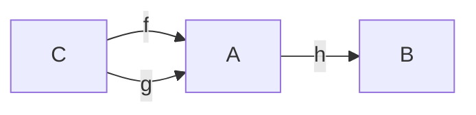
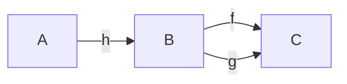
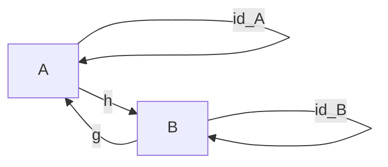
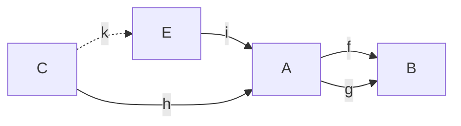
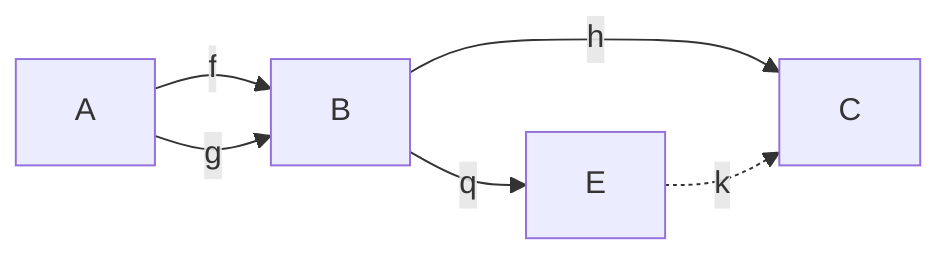

# Noções preliminares

> Anotações a partir de Topoi (cap. 11).

## Categorias

Uma categoria $C$ é composta dos seguintes elementos básicos

1. Uma coleção $C$ de objetos;
2. Para cada par $\langle A, B \rangle$ de objetos, uma coleção de morfismos (em $C$) de $A$ em $B$. Essa coleção denota-se $Hom_C(A,B)$;
3. Uma operação parcial $\circ$ de composicão entre morfismos. 
4. Para cada objeto $A$, um morfismo $id_A$ tal que (1) $f \circ id_A = f$; e (2) $id_A \circ g = g$.


Na categoria **Type**, objetos são tipos *nat, list, bool,* etc, morfismos são funções

```coq
f : A -> B
```

onde $A, B$ são tipos. A função identidade é definida da seguinte maneira

```coq
Definition id {X : Type} a : X := a.
```

e a composição da seguinte maneira

```coq
Definition comp 
{X Y Z: Type} 
(f : X -> Y) (g: Y -> Z) := 
fun a => g (f a).
```

Nesta definição, $f$ vive em $Hom_{Type}(X,Y)$ e $g$ vive em $Hom_{Type}(Y, Z)$.

### Monomorfismos

> Generaliza a noção de função injetiva.

Uma flecha $h : A \rightarrow B$ é um monomorfismo se e somente se $h \circ g = h \circ f$ implica que $g = f$ para todo $g, f : C \rightarrow A$.



> Um monomorfismo é uma flecha que pode ser cancelada a esquerda da composição.

### Epimorfismos

> Generaliza a noção de função sobrejetiva.

> Intuição de imagem "suficientemente grande".

Uma flecha $h : A \rightarrow B$ é um epimorfismo se e somente se $g \circ h = f \circ h$ implica que $g = f$ para todo $g, f : B \rightarrow C$.



> Um epimorfismo é uma flecha que pode ser cancelada a direita da composição.

### Isomorfismos

> Um isomorfismo é uma flecha invertível.

Uma flecha $h : A \rightarrow B$ é um isomorfismo se e somente se existe uma flecha $g : B \rightarrow A$ tal que 

1. $h \circ g = id_A$; e
2. $g \circ h = id_B$.



De modo geral, $g$ é a inversa de $h$, representada por $h^{-1}$.


### Objeto inicial

Um objeto $x$ de uma categoria $C$ é inicial se e somente se, para cada objeto $y$ em $C$, existe uma única flecha $0_y : x \rightarrow y$.

> Usualmente, denota-se o objeto inicial como $0$.
> > Exemplo: o conjunto vazio $\emptyset$ é o único objeto inicial da categoria **Set**.

### Objeto terminal

Um objeto $x$ de uma categoria $C$ é terminal se e somente se, para cada objeto $y$ em $C$, existe uma única flecha $1_y : y \rightarrow x$.

> Usualmente, denota-se o objeto terminal como $1$.
> > Exemplo: na categoria **Set**, existem infinitos objetos terminais (isomorfos): os conjuntos unitários.

### Equalizador

> O **maior lugar** em que dois morfismos coincidem.

Sejam $f, g : A \rightarrow B$ duas flechas. O equalizador de $f$ e $g$ é um par $\langle E, i \rangle$ tal que 

1. A flecha $i : E \rightarrow A$ satisfaz $f \circ i  = g \circ i$;
2. Se $\langle C , h \rangle$ é tal que $h : C \rightarrow A$ satisfaz $f \circ h = g \circ h$ então existe uma única flecha $k : C \rightarrow E$ que comuta o diagrama.



### Coequalizador

> O menor lugar em que dois morfismos coincidem.

Sejam $f,g : A \rightarrow B$ duas flechas. O coequalizador de $f$ e $g$ é um par $\langle E, q \rangle$  tal que

1. A flecha $q : B \rightarrow E$ satisfaz $q \circ f = q \circ g$;
2. Se $\langle C, h \rangle$ é tal que $h : B \rightarrow C$ satisfaz $h \circ f = h \circ g$ então existe uma única flecha $k : E \rightarrow C$ que comuta o diagrama.


> Equalizador e coequalizador são conceitos duais.
> 
### Pullback

> Produto fibrado.

### Pushout

### Limite

### Funtores

Um funtor $F$ é um morfismo que leva de uma categoria $X$ para outra categoria $Y$ preservando a estrutura original, isto é,

1. Para cada objeto $a$ de $X$, existe um objeto $F(a)$ correspondente em $Y$;
2. Para cada morfismo $f : a \rightarrow b$, um morfismo $F(f) : F(a) \rightarrow F(b)$, tal que: 
   1. $F(1_a) = 1_{F(a)}$;
   2. $F(g  \circ f) = F(g) \circ F(f)$, sempre que a composição existe.


 Quando $X = Y$, $F$ é um **endofuntor**. 

> **id** é um exemplo de endofuntor.


Para ilustrar, considere o tipo parametrizado *Maybe* definido abaixo.

```coq
Inductive Maybe (X : Type) :=
| Some (a : X)
| None.

Check Some nat 2.
: Maybe nat
```

Observe que *Maybe* não é um tipo, mas um construtor de tipos. 

```coq
Check Maybe.
: Type -> Type
```

Para um morfismo $F$ ser um funtor, além de $F$ mapear objetos (no caso, tipos) de um tipo a outro, $F$ deve mapear todos os morfismos entre os objetos daquele tipo. Por exemplo, seja $f$ um morfismo 

```
f : nat -> bool
```


Para isso, definimos a função de ordem superior **fmap** abaixo

```coq
Definition fmap 
{X Y : Type}
(f : X -> Y)
: Maybe X -> Maybe Y :=
fun (a : Maybe X) =>
match a with
| Some _ b => Some Y (f b)
| None _ => None _
end.
```

De modo mais geral, podemos definir a classe dos endofuntores na categoria *Type* da seguinte maneira

```coq
Class Functor
(X Y : Type)
(f : Type -> Type) :=
{
  fmap2 : (X -> Y) -> f X -> f Y
}.
```

Sendo o funtor Maybe um caso particular (instância)

```coq
Instance MaybeMap {X Y : Type} : 
Functor X Y Maybe :=
{
  fmap2 f a := 
    match a with
    | Some _ b => Some _ (f b)
    | None _ => None _
    end
}.
```


## Topos

### Subobjeto

> Generaliza a noção de subconjunto


Um topos é uma categoria.

## Reticulado

Um reticulado é um conjunto $R$ equipado com duas operações binárias, **meet** $(a \sqcap b)$ e **join** $(a \sqcup b)$, com relação as quais valem as seguintes identidades para todos elementos $a,b,c \in R$:

### Comutatividade
1. $a \sqcap b = b \sqcap a$;
2. $a \sqcup b = b \sqcup a$;
   
### Associatividade
3. $a \sqcap (b \sqcap c) = (a \sqcap b) \sqcap c$;
4. $a \sqcup (b \sqcup c) = (a \sqcup b) \sqcup c$;

### Absorção
5. $a \sqcup (a \sqcap b) = a$;
6. $a \sqcap (a \sqcup b) = a$;

### Idempotência
7. $a \sqcup a = a$;
8. $a \sqcap a = a$.

### Ordem

Uma ordem em um reticulado $R$ é uma relação entre elementos $a, b$ de $R$, denotada por $a \sqsubseteq b$ (a é menor ou igual a b). Essa relação respeita os seguintes axiomas.

1. $\forall a : a \sqsubseteq a$ [Reflexividade] 
2. $\forall a, b : a \sqsubseteq b \land b \sqsubseteq a \rightarrow a = b$ [Anti-simetria]
3. $\forall a, b, c : a \sqsubseteq b \land b \sqsubseteq c \rightarrow a \sqsubseteq c$ [Transitividade]

## Álgebra de Heyting

> (cap. 8)

Proposta em $1930$ por Arend Heyting, trata-se de um sistema axiomático da lógica proposicional que gera como teoremas aquelas, e apenas aquelas, "sentenças que são válidas de acordo com a *concepção intuicionista da verdade*" (p. $177$). 

> (p.177-178, sec 8.2)
>> Of course the intuitionist only accepts formal systems as **imperfect tools** for description and communication. He leaves open the possibility that his intuitive deliberations will one day reveal as yet unheard of principles of reasoning. According to Heyting, 'in principle it is impossible to set up a formal system which would be equivalent to intuitionist mathematics ... it can never be proved with mathematical rigour that the system of axioms really embraces every valid method of proof.' 

## Limite superior e limite inferior

Primeiro, precisamos ampliar o sentido da relação $\sqsubseteq$, que foi definida anteriormente apenas para pares de elementos. Nesse contexto, $x \sqsubseteq y$ denota **y é maior que x** (ou **x é menor ou igual a x**). Na extensão que será feita nesta seção, permitiremos que os parâmetros sejam conjuntos. Queremos que $A \sqsubseteq x$ denote **x é limite superior do conjunto A** e $x \sqsubseteq A$ denote **x é limite inferior do conjunto A**. Para isso, quantificaremos sobre o conjunto de elementos.

Seja $A$ um sub-conjunto de um reticulado $R = (L, \sqsubseteq)$ e $x$ um elemento de $R$. Definimos:

1. **Limite superior** $(A \sqsubseteq x)$

$$
\forall y (y \in A \rightarrow y \sqsubseteq x)
$$

2. **Limite inferior** $(x \sqsubseteq A)$

$$
\forall y (y \in A \rightarrow x \sqsubseteq y)
$$

A partir dessa extensão, poderemos definir limite superior mínimo e limite inferior máximo.

> Seja $A$ um subconjunto de um reticulado $R = (L, \sqsubseteq)$, e $x \in L$. Dizemos que $x$ é um **limite superior** de $A$ ($A \sqsubseteq x$), se, para todo $y \in A$, $y \sqsubseteq x$.
>> Ou seja, $x$ é limite superior de $A$ se $x$ for limite superior de todos os elementos de $A$.

Se, além disso, $x \sqsubseteq z$ para todo $A \sqsubseteq z$ (ou seja, todo limite superior de $A$ é um limite superior de $x$), então $x$ é minimal, que chamaremos de **limite superior mínimo** (l.s.min).

> Diremos que $x$ é o **maior elemento** de $A$ se $x \in A$ e $x$ é l.s.min de $A$.

### Exercícios
#### Exercício 1
> *A possui no máximo um limite superior mínimo.* 
> >**Prova:** Supõe que $x$ é um limite superior mínimo de $A$. Então, além de $A \sqsubseteq x$, $x$ é minimal. Agora supõe que existe outro limite superior mínimo de $A \sqsubseteq x'$. Por definição, para todo $A \sqsubseteq z$, temos que $x' \sqsubseteq z$. Como $A \sqsubseteq x$, temos que $x' \sqsubseteq x$. De maneira análoga, como $x$ é minimal, temos que $x \sqsubseteq x'$. Logo, $x = x'$ (por anti-simetria).

#### Exercício 2

> Defina **limite inferior máximo**. 
> >Seja $A$ um sub-conjunto de um reticulado $R_L = (L, \sqsubseteq)$ e $x \in L$. Diremos que $x \sqsubseteq A$ ($x$ é um limite inferior de $A$) se, e somente se, $x \sqsubseteq y$ para todo $y \in A$. Se, além disso, $z \sqsubseteq x$ para todo $z \sqsubseteq A$, então $x$ é um limite inferior máximo.

#### Exercício 3

> *Um limite inferior máximo de A é o maior elemento do conjunto de limites inferiores de A.*
> > **Prova:** Seja $x$ um limite inferior máximo de $A$. Precisamos mostrar que (1) $x$ é um elemento do conjunto de limites inferiores de $A$ (chamaremos de $\Omega$); e (2) $x$ é l.s.min de $\Omega$. Como $x$ é l.i.max de $A$, em particular $x$ é um limite inferior de $A$ e, portanto, temos que $x \in \Omega$. Resta mostar que $x$ é l.s.min de $\Omega$, ou seja: (2.a) $\Omega \sqsubseteq x$;  e (2.b) $\forall z$, se $\Omega \sqsubseteq z$, então $x \sqsubseteq z$. Sabemos que $\Omega \sqsubseteq x$ sse $y \sqsubseteq x$ para todo $y \in \Omega$. Por definição, $x$ é o l.i.max de $A$; logo, para todo limite inferior de $A$ (chamemos de $z$), vale que $z \sqsubseteq x$. Ora, $\Omega$ é justamente o conjunto de limites inferiores de $A$, portanto, para todo $x' \in \Omega$, temos que $x' \sqsubseteq x$ (2.a).

#### Exercício 4

> Defina o **menor elemento** de $A$.
> > Diremos que $x$ é o **menor elemento** de $A$ se: 
> > 1. $x \in A$;
> > 2. $x$ é l.i.min de $A$. 


> Exemplo: considere o reticulado conjunto das partes de $X$ $(P(X), \subseteq)$. Nesse reticulado, o menor elemento é o conjunto vazio $(\emptyset)$; e o maior elemento é $X$. 

### Complemento

O **complemento** (ou **pseudo-complemento**, já que pode ser uma operação não-booleana [a depender do reticulado]) de um elemento $a$ de um reticulado $R = (L, \sqsubseteq)$, denotado por $\bar{a}$, é o maior elemento disjunto de $a$:

$$
\bar{a} = max (x \in L  \mid a \sqcap x = 0)
$$

> Isso implica que, no exemplo do reticulado do conjunto das partes, $A \cap \bar{A} = \emptyset$ [porque disjunto] e, sempre que $A \cap B = \emptyset$, então $B \subseteq \bar{A}$ [porque maximal].

Um reticulado $R$ tal que todo elemento de $R$ possui um pseudo-complemento é um **reticulado pseudo-complementado**.

#### Exercício 5

> $b$ é o maior disjunto de $a$ precisamente quando $b$ satisfaz a condição: 
> 
> >(C) $\forall x \in L$, $x \sqsubseteq b$ $\Leftrightarrow$ $a \sqcap x = 0$.
> 
> > Supõe que $b$ satisfaz a condição (C). Então temos que mostrar que $b$ é o maior disjunto de $a$. Considere o conjunto $\Omega$ de todos os $x \sqsubseteq b$, isto é, o conjunto dos limites inferiores de $b$. Por definição, $b$ é um limite superior de $\Omega$. Para obter minimalidade, observe que $\sqsubseteq$ é transitivo. Portanto, $b$ é l.s.min de $\Omega$. Como, além disso, $b \in \Omega$, temos que $b$ é o maior elemento de $\Omega$, por definição. Além disso, por hipótese $(\Leftarrow)$, todos os disjuntos de $a$ estão no conjunto $b$. Portanto, $b$ é o maior disjunto de $a$.

#### Exemplos

Dados $A, B \in D$, definimos

1. Complemento: $\bar{A} = \{x \mid x \in D$ e $x \not\in A\}$
2. Intersecção: $A \cap B = \{ x \mid x \in A$ e $x \in B \}$ 
3. União: $A \cup B = \{ x \mid x \in A$ ou $x \in B \}$

O conjunto das partes $P(D)$, junto com as operações $\cap, \cup, \bar{}$ , "exibem a estrutura daquilo que entendemos por ... Álgebra booleana" (cap. 6, pag. 125)

> These algebras, to be defined shortly, are intimately connected with the classical account of logical truth. (p. 125)

No reticulado do conjunto das partes  $R = (P(D), \subseteq)$, $\bar{A}$ é o pseudo-complemento de $A$. Para provar isso, temos que mostrar que, para todo elemento $x$ de $P(D)$, se $x$ está contido no complemento de $A$, então $x$ é disjunto de $A$. Além disso, se $x$ é disjunto de $A$, então $x$ está contido no complemento de $A$ ($\bar{A}$ é maximal). Ou seja:

$$
    \forall x \in P(D), x \subseteq \bar{A} \Leftrightarrow A \cap x = \emptyset
$$

> Assuma que $x \subseteq \bar{A}$. Nesse caso, todo elemento de $x$ está em $\bar{A}$. Pela definição de complemento, $\bar{A}$ não possui nenhum elemento de $A$. São, portanto, disjuntos. Por definição de sub-conjunto, não existe nenhum elemento em $x$ além daqueles que estão em $\bar{A}$; em particular, não existe nenhum elemento de $A$ em $x$, isto é, $x$ e $A$ também são disjuntos. Para a volta, assuma que $A \cap x = \emptyset$. Observe que o complemento contém todos os elementos que não estão em $A$, já que pega todos os elementos do universo $(D)$ que não pertencem a $A$. Portanto, se $A$ é disjunto de $x$, então $x$ deve estar contido em $\bar{A}$.


### Definição de uma álgebra de Heyting


> Uma **álgebra de Heyting** (**HA**) é um reticulado $\Omega = (H, \sqsubseteq)$ relativamente pseudo-complementado que possui um zero (**0**).


Uma álgebra de Heyting é completa quando todo subconjunto de $\Omega$ possui l.s.max e l.i.min.

# Conjuntos Heyting-valorados

## Linguagem

### Alfabeto

1. Uma lista infinita $v_1,v_2, \cdots$ de variáveis individuais;
2. Conectivos proposicionais $\land, \lor, \sim, \supset$;
3. Símbolos de quantificação $\forall, \exists$;
4. Símbolo de identidade $\approx$;
5. Parênteses ), (.

> A partir desta linguagem, podemos descrever uma estrutura listando seus **símbolos de relação**, **letras de função** e **constantes individuais**.

Exemplo: 

$$
 \textbf{BA} = \\{ 0,1,f,g,h \\}
$$

onde $f(v)$ significa "o complemento de $v$", $g(v_1,v_2)$ significa "o meet de $v_1$ com $v_2$" e $h(v_1,v_2)$ significa "o join de $v_1$ com $v_2$".

> (cap. 11, sec. 9, pp. 274--..).

Podemos compreender objetos em um topos como entidades "set-like"  **parcialmente existentes** (*partially existent*). Apenas alguns desses elementos são **fortemente existentes** (*actually existent*). O fato de que um elemento $c$ é **fortemente existente** é expresso por $\textbf{E(c)}$

1. $\textbf{E(c)} \equiv \exists v (v\approx \textbf{c})$

Para derivar (1), utiliza-se o seguinte

> **Princípio** "tudo que é igual a algo que existe, existe".

> Observe que $\textbf{E}$ é um predicado e $v$ varia entre os elementos parcialmente existentes (objetos do topos).

**Princípio** "elementos só podem ser iguais se existentes". Em outras palavras, "igualdade implica existência". Formalizando:

2. $v \approx w \supset E(v) \land E(w)$

> Este princípio é mais forte que o princípio utilizado para derivar (1). Chamaremos de **equivalência forte**.

## Dois sentidos para "sameness"


**Bicondicional** $\equiv$. Relação entre fórmulas.

$$
    A \equiv B  \Leftrightarrow (A \supset B) \land (B \supset A)
$$

Onde $A$ e $B$ são fórmulas válidas.


**Equivalência enfraquecida** ≋. Relação entre objetos. Dois elementos $v$ e $w$ são **fracamente equivalentes** quando: **(a)** nenhum deles existe; ou **(b)** quando ambos existem e são iguais.

3. $v ≋ w \equiv (E(v) \lor E(w) \supset v \approx w)$

> Essa noção de equivalência enfraquecida "não diferencia os elementos com respeito a sua inexistência". Se dois elementos não existem eles são fracamente equivalentes.

Em suma, $\approx$ e ≋ são duas relações simétricas: é possível descrever a igualdade em termos da equivalência.

4. $v \approx w \equiv (v ≋ w) \land (E(v) \land E(w))$

Ou seja, dois elementos $v$ e $w$ são idênticos se, e somente se, ambos existem e são fracamente equivalentes.

## [TODO] Exemplo do Bundle

## Concepção generalizada de conjunto

> p. 276-..

Um **conjunto** é uma coleção de elementos parciais, com alguma medida alébrica Heyting-valorada de graus de igualdade (*equality*) entre eles.

Essa noção admite o seguinte "desenvolvimento axiomático abstrato":

> Uma álgebra de Heyting completa (**AHC**) é uma álgebra de Heyting na qual todo sub-conjunto $A \subseteq \Omega$ possui um "limite superior mínimo" (*least upper bound*), denotado por $\sqcup A$, e um "limite inferior máximo" (*greatest lower bound*), denotado por $\sqcap A$.

Seja $(\Omega, \sqsubseteq)$ uma **AHC**.